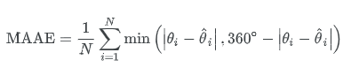

# IIIT-H Campus Viewpoint Prediction

This repository contains the code and documentation for a project carried out as part of my Research Assistantship at **Virtual Labs, IIIT-Hyderabad (Vlabs)**.

The objective of this project is to **predict the angle (direction with respect to North) and the Region ID** using a photograph taken from the **IIIT-H campus**. 

---

## Problem Statement

Given a dataset of campus images with associated metadata, the goal is to predict:

- **Region ID** (from 1 to 15): Indicates the region in the campus where the image was captured.
- **Angle** (in degrees from North): Orientation of the camera when the image was taken.

---

##  Dataset Description

Each data point consists of:

- A campus image
- Metadata including Region ID, angle, latitude, longitude, and timestamp

### Dataset Files

- `labels_train.csv`: Labels for the training set
- `labels_val.csv`: Labels for the validation set
- `images_train.zip`: Images corresponding to the training set
- `images_val.zip`: Images corresponding to the validation set

### Columns in CSV files

| Column      | Description                                                                 |
|-------------|-----------------------------------------------------------------------------|
| filename    | Name of the image file                                                      |
| timestamp   | Time of capture (not used in model)                                         |
| latitude    | Approximate latitude where the image was captured                           |
| longitude   | Approximate longitude where the image was captured                          |
| angle       | Angle in degrees (0° = North) at which the image was taken                  |
| Region_ID   | Region ID (1 to 15) of the location where the image was captured            |

### Data Split

- ~6542 images in the training set
- 369 images in the validation set
- 369 images in the test set

---

## Evaluation Metrics

### Region ID Prediction

- **Accuracy**: Proportion of correct predictions.

### Angle Prediction

- **Mean Absolute Angular Error (MAAE)**:
  
  The angle error is calculated using the following formula:
  
  
  
  Where `theta` is the ground truth and `theta_hat` is the predicted angle. This ensures circular continuity (e.g., 359° and 1° are only 2° apart).

---

##  Approach

###  Region Classification Model

This project implements a fine-tuning approach for region classification using the **ConvNeXt Tiny** architecture pre-trained on ImageNet. The model classifies images into 15 distinct regions.

####  Key Features

- **Base Model**: ConvNeXt Tiny (modern CNN architecture with transformer-inspired design)
- **Transfer Learning**: Fine-tuned on IIIT-H campus data
- **Preprocessing**: 
  - Resized images to 256×256
  - Applied data augmentation with random horizontal flips and color jitter
- **Regularization**: 
  - Dropout (0.3)
  - Stochastic depth (0.3)
- **Optimization**:
  - Used `ReduceLROnPlateau` scheduler for learning rate adjustment
  - Evaluated multiple learning rates and regularization parameters
- **Checkpointing**: Saved best model based on validation performance

 **Link to Best Trained Model**:  
[ConvNeXt Region Classifier (Google Drive)](https://drive.google.com/file/d/1Z2WblIJPAGopGTaHa4q4-5OlOOfuHHAA/view?usp=drive_link)

---

###  TerrainAngleNet – Angle Prediction Model

This model predicts the camera orientation (angle from North) using a ViT-based architecture.

####  Key Features

- **Base Model**: DINOv2 ViT-B/14 (pre-trained by Facebook AI)
- **Transfer Learning**: Fine-tuned for angular regression
- **Augmentation**: 
  - Used `RandAugment` for stronger image transformations
  - Ensured diversity in training samples
- **Regularization**:
  - Stochastic depth to prevent overfitting
- **Output Representation**:
  - Model outputs a normalized 2D vector (`cos(θ), sin(θ)`)
  - Final angle is computed as `atan2(sin, cos)`
- **Loss**:
  - Used **Mean Squared Error** on sine/cosine vector
- **Evaluation**:
  - Evaluated using **Mean Absolute Angular Error (MAAE)** in degrees

 **Link to Best Saved Model**:  
[DINOv2 TerrainAngleNet (Google Drive)](https://drive.google.com/file/d/1lm-jnPq3r71e7kHFO8JMM6vln6CZ2Zrc/view?usp=sharing)

---

##  Results

### Region ID Prediction

- **Best Accuracy Achieved**: **96.74%**

### Angle Prediction

- **Best Mean Absolute Angular Error (MAAE)**: **23.809°**

-- Corresponding Solutions to Test set are present in the solutions csv file inside each model folder.

---

